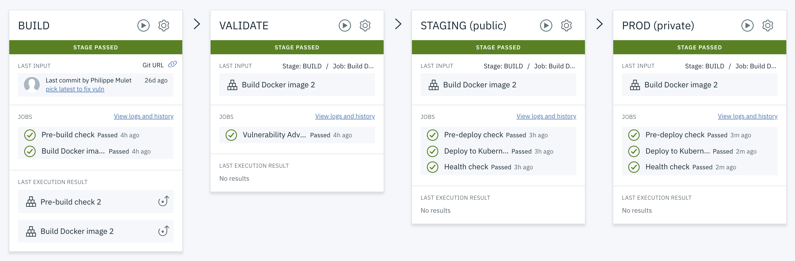

#  Develop a Kubernetes app in hybrid cloud


### Develop a secure Docker app in public Cloud for staging and private Cloud for production 
This Hello World application uses Docker with Node.js and includes a DevOps toolchain that is preconfigured for continuous delivery with Vulnerability Advisor, source control, issue tracking, and online editing, and staging deployment to the IBM Cloud Kubernetes Service (IKS) and final production deployment to IBM Cloud Private (ICP) or an 
Openshift Container Platform (OCP).


Application code is stored in source control, along with its Dockerfile and its Kubernetes deployment script.
The target cluster is configured during toolchain setup (using a IBM Cloud API key and cluster name). You can later change these by altering the Delivery Pipeline configuration.
Any code change to the Git repo will automatically be built, validated and deployed into Kubernetes clusters.



### Prerequisites

You need to get a non expiring token to deploy continuously into your prod Kubernetes cluster (ie. most user tokens have a short life span and are not suitable for a long running pipeline). This typically is accomplished using a permanent service account token that will be used by pipeline to deploy, and obtained by a cluster administrator.

Below are suggested instructions for forging such a permanent service account token for different Kubernetes providers, using your cluster admin credentials initially. 

As a cluster administrator, you need first to connect to the prod cluster:
- Connecting to IBM Cloud Private (ICP)
  - Available as [hosted trial](https://www.ibm.com/cloud/garage/dte/tutorial/ibm-cloud-private-hosted-trial) 
  - See [also](https://www.ibm.com/developerworks/community/blogs/fe25b4ef-ea6a-4d86-a629-6f87ccf4649e/entry/Configuring_the_Kubernetes_CLI_by_using_service_account_tokens1?lang=en).
  - Log in to your private cluster management console. Also see [Accessing your IBM® Cloud Private cluster by using the management console](https://www.ibm.com/support/knowledgecenter/SSBS6K_2.1.0/manage_cluster/cfc_gui.html?view=kc).
  - Select User Name > Configure client, which is in the upper right of the window.
  - Copy and paste the configuration information to your command line, and press Enter 
- Connecting to local Docker Desktop (https://www.docker.com/products/docker-desktop)
  - Launch docker desktop, ensuring kubernetes is enabled
  - `kubectl config use-context docker-desktop`
- Connecting to OpenShift Container Platform such as an online cluster (https://manage.openshift.com/)
  - In cluster console, select User Name > Copy Login Command
  - Copy and paste the configuration information to you command line, and press Enter

#### Find cluster master address/port

- For a plain Kubernetes target, use the `kubectl` CLI:
  Run command `kubectl cluster-info` will show these information. E.g. 
  ```
  Kubernetes master is running at https://kubernetes.docker.internal:6443
  KubeDNS is running at https://kubernetes.docker.internal:6443/api/v1/namespaces/kube-system/services/kube-dns:dns/proxy
  ```
  Cluster master address is here `kubernetes.docker.internal` and port is `6443`.
  
- For an OpenShift Container Platform target, view the cluster server's address and port by using the oc config command: `oc config view`.
  The output of this command indicates the current context. The server adress is the server entry in the clusters lis.
  If `jq` (https://stedolan.github.io/jq/), and `yq` (https://github.com/mikefarah/yq) are installed, you can run the following command to obtain the openshift server:
  ```
  oc config view --raw | yq read - --tojson | jq -r --arg current_oc_cluster "$(oc config view --raw | yq read - current-context | awk -F/ '{print $2}')" '.clusters[] | select(.name==$current_oc_cluster) | .cluster.server'
  ```

#### Creating namespace

- Create target cluster namespace if not already existing, ie. with command line: 
  - For a plain Kubernetes cluster target, use the `kubectl` CLI:
  ```
  CLUSTER_NAMESPACE=prod
  kubectl create namespace ${CLUSTER_NAMESPACE}
  ```
  - For an OpenShift cluster, use the `oc` CLI:
  ```
  CLUSTER_NAMESPACE=prod
  oc new-project  ${CLUSTER_NAMESPACE}
  ```

#### Creating service account

- Either create a specific service account in cluster, or leverage the existing `default` service account as instructed below to retrieve its token.
  - For a plain Kubernetes cluster target, use the `kubectl` CLI:
    ```
    SERVICE_ACCOUNT_NAME=default
    SECRET_NAME=$(kubectl get sa "${SERVICE_ACCOUNT_NAME}" --namespace="${CLUSTER_NAMESPACE}" -o json | jq -r .secrets[0].name)
    SERVICE_ACCOUNT_TOKEN=$(kubectl get secret ${SECRET_NAME} --namespace ${CLUSTER_NAMESPACE} -o jsonpath={.data.token} | base64 -d)
    echo ${SERVICE_ACCOUNT_TOKEN}
    ```
  - For an OpenShift cluster, use the `oc` CLI:
    ```
    oc project ${CLUSTER_NAMESPACE}
    SERVICE_ACCOUNT_NAME=default
    SERVICE_ACCOUNT_TOKEN=$(oc serviceaccounts get-token $SERVICE_ACCOUNT_NAME)
    echo ${SERVICE_ACCOUNT_TOKEN}
    ```
    
#### Grant admin permission to service account

- For a plain Kubernetes cluster target, ensure admin permission for chosen service account in specific namespace:
```
# grant admin permission (rbac)
kubectl create clusterrolebinding cd-admin --clusterrole=admin --serviceaccount=${CLUSTER_NAMESPACE}:${SERVICE_ACCOUNT_NAME} 
```

- If target is OpenShift cluster, instead use the following to scope in specific namespace only:
```
# grant admin permission (rbac)
kubectl create rolebinding cd-admin --clusterrole=admin --serviceaccount=${CLUSTER_NAMESPACE}:${SERVICE_ACCOUNT_NAME} --namespace=${CLUSTER_NAMESPACE}
```

#### Get permanent token for service account
- Copy and save the value of `SERVICE_ACCOUNT_TOKEN`, it will be needed for later configuring pipeline in IBM Cloud public

### To get started, click this button:
[](https://cloud.ibm.com/devops/setup/deploy?repository=https%3A%2F%2Fgithub.com%2Fopen-toolchain%2Fhybrid-kube-toolchain&env_id=ibm:yp:us-south)

### Tutorial steps
1. Setup this hybrid toolchain demonstrating how to build/test in IKS and deploy into private cluster (e.g. ICP or OCP)
2. See 'prod' deploy failing because cannot connect from IBM Cloud public into private cluster target
3. Install a pipeline private worker in that private cluster. 
   - Ensure that this private cluster is allowed to pull images from registries: `ibmcom/*` and `gcr.io/tekton-releases`
```
cat <<EOF | kubectl apply -f -
apiVersion: securityenforcement.admission.cloud.ibm.com/v1beta1
kind: ClusterImagePolicy
metadata:
  name: tekton-private-worker
spec:
  repositories:
  - name: "gcr.io/tekton-releases/*"
    policy:
  - name: "docker.io/ibmcom/*"
    policy:
EOF
```
   - Install worker: [instructions](https://cloud.ibm.com/docs/services/ContinuousDelivery?topic=ContinuousDelivery-install-private-workers), save its service API key.
4. Add a toolchain integration with this private pipeline worker, using the above service API key
5. Configure 'prod' deploy stage to run on the configure private worker
   - Ensure this private cluster is allowed to pull images from IKS registry: `*.icr.io/*`
```
cat <<EOF | kubectl apply -f -
apiVersion: securityenforcement.admission.cloud.ibm.com/v1beta1
kind: ClusterImagePolicy
metadata:
  name: iks-private-registries
spec:
  repositories:
  - name: "*.icr.io/*"
    policy:
EOF
```
6. Re-run the pipeline and see the prod deployment stage succeeding

### Troubleshooting

#### Pipeline DEPLOY (private) failing: "error: You must be logged in to the server (Unauthorized)"

Check that a valid service account token has been configured in the pipeline. This would typically occur over time when the target cluster got recreated, and forgot to re-run steps above to obtain a new service account token.

The service account token is configured in pipeline "DEPLOY (private)" stage, under its environmnent properties tab, property name is: KUBERNETES_SERVICE_ACCOUNT_TOKEN.

---
### Learn more 

* Blog [Continuously deliver your app to Kubernetes with IBM Cloud](https://www.ibm.com/blogs/bluemix/2017/07/continuously-deliver-your-app-to-kubernetes-with-bluemix/)
* Step by step [tutorial](https://www.ibm.com/cloud/garage/tutorials/devops-toolchain-integration?task=7)
* [Installing a private pipeline worker](https://cloud.ibm.com/docs/services/ContinuousDelivery?topic=ContinuousDelivery-install-private-workers)
* [Getting started with IBM Cloud Kubernetes](https://cloud.ibm.com/docs/containers?topic=containers-getting-started)
* [Getting started with IBM Cloud Private](https://www.ibm.com/cloud/private/get-started)
* [Getting started with toolchains](https://cloud.ibm.com/devops/getting-started)
* [Documentation](https://cloud.ibm.com/docs/services/ContinuousDelivery/index.html?pos=2)
